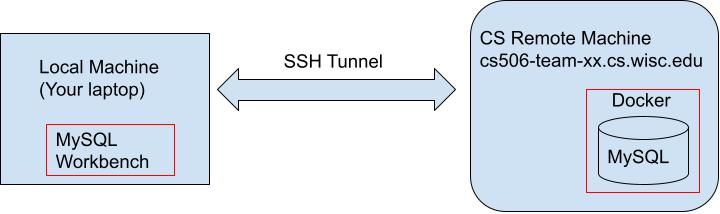
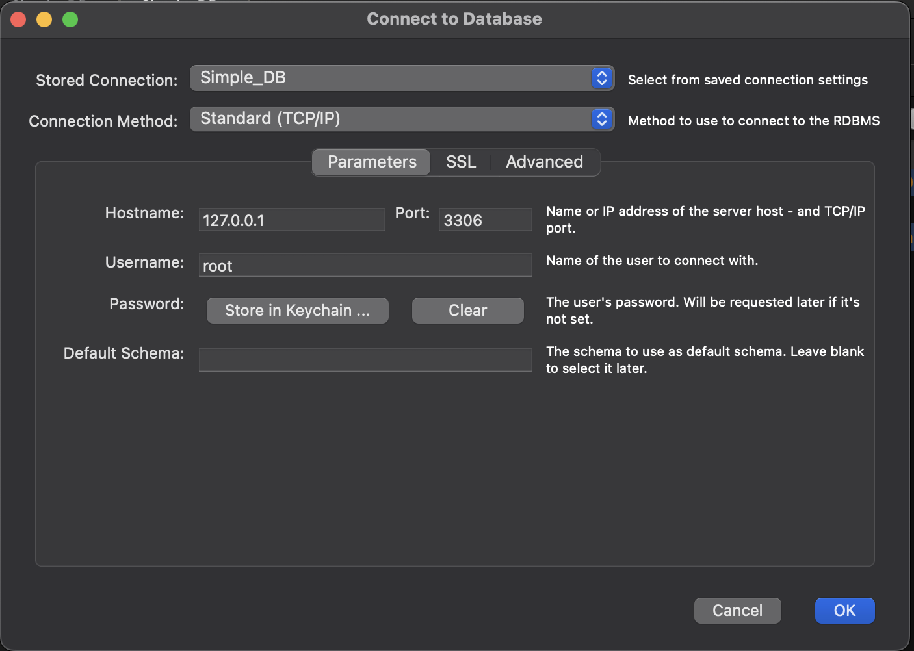
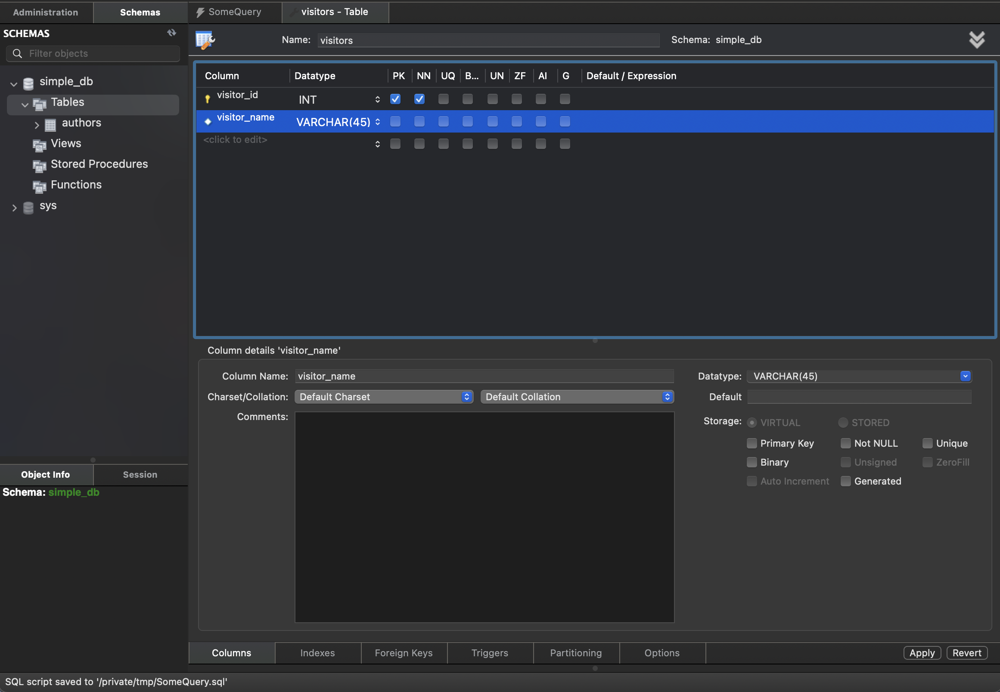
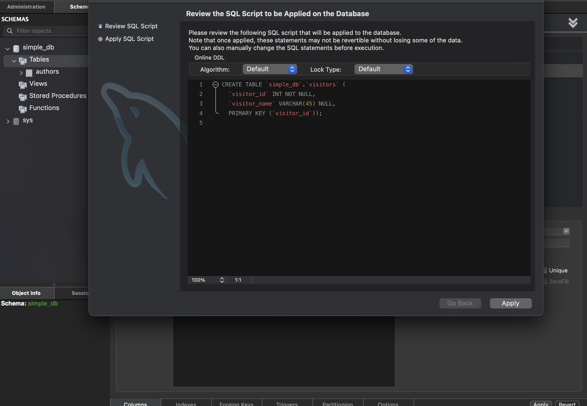
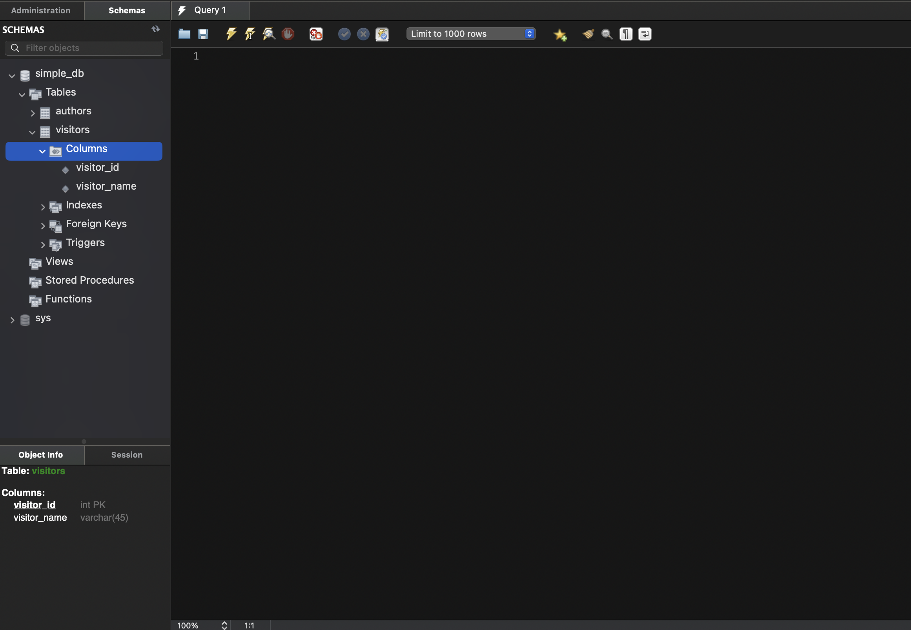
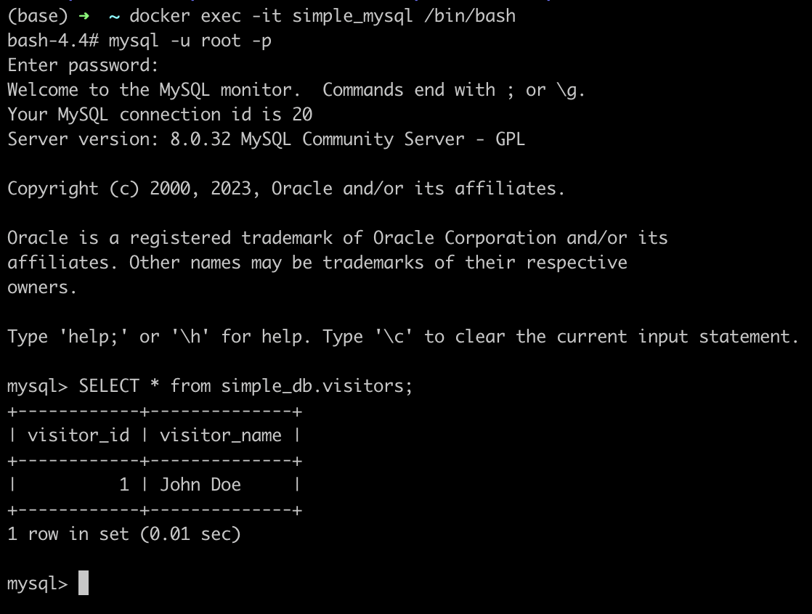

# COMP SCI 506 MySQL Tutorial

Objective:
To demonstrate accessing mysql database hosted on remote machine's docker container from mysql worbench installed on local machine.
Pictorially,



This tutorial assume students have access to Remote Machine(RM) i.e cs506-team-XX.cs.wisc.edu

### 0. Install Docker on Remote Machine(RM)
Refer to this tutorial for installing and learning basics of Docker
https://github.com/himanshusagar/CS506_Docker_Tutorial

### 1. Install MySQL WorkBench on Local Machine(RM)
Refer to this link for downloading and installing Workbench - https://www.mysql.com/products/workbench/

### 2. On Remote machine
#### 2.1 SSH to Remote Machine
```shell
ssh hsagar2@cs506-team-XX.cs.wisc.edu
````
#### 2.2 Run Docker Container
1. Read through yaml file provided with tutorial - docker-compose.yml. Your teams' machines should have containers spawned by following
yaml already. If not, you can run them using `docker compose up`. Notice:
   1. db2 is mysql container with
      1. password : `splung3`
      2. db name : `splunge_db`
      3. root host : `'%'` (so that root can connect from any host. This will be helpful in connecting to DB from outside the container).
      4. volumes mapping to `/var/lib/mysql`.

```yaml
version: '3.8'
services:
   db2:
      image: mysql/mysql-server:latest
      restart: always
      environment:
         MYSQL_ROOT_PASSWORD: splung3
         MYSQL_DATABASE: splunge_db
         MYSQL_ROOT_HOST: '%'
      volumes:
         - splungedat:/var/lib/mysql
      ports:
         - "60666:3306"
   phpmyadmin2:
      image: phpmyadmin/phpmyadmin:latest
      restart: always
      depends_on:
         - db2
      environment:
         PMA_HOST: db2
         PMA_USER: root
         PMA_PASSWORD: splung3
      ports:
         - "60680:80"
volumes:
   splungedat:
```


#### 2.3 Insert some data into DB
1. Open new terminal, ssh into remote machine again!
```shell
ssh hsagar2@cs506-team-XX.cs.wisc.edu
````
2. SSH into container
```shell
docker exec -it cs506_mysql_tutorial-db2-1 /bin/bash
```
3. Connect to container's MySQL.
```shell
mysql -u root -p
```
4. Insert whatever password you used in step  2.2 Run Docker Container.
5. Run following queries for dummy data.
```sql
USE simple_db;
CREATE TABLE teammates (id INT, name VARCHAR(20), email VARCHAR(20));
SHOW TABLES;
INSERT INTO teammates (id,name,email) VALUES(1,"Himanshu Sagar","hsagar@abc.def");
SELECT * from teammates;
```
5. Quit MySQL prompt
```sql
quit
```
6. Exit container's bash shell.
```shell
exit
```

### 3. On Local machine
Open a terminal.
#### 3.1 SSH Tunnel 
We need to SSH tunnel 3306 port of remote machine to local machine's 3306 port.
Use your username and machine name instead of `hsagar2` and `cs506-team-XX` respectively.
```shell
ssh -L 60666:cs506-team-XX.cs.wisc.edu:60666 hsagar2@cs506-team-XX.cs.wisc.edu
```
Enter CS Login Password and perform DUO authentication.

#### 3.2 Open Workbench
Open MySQL Workbench.

3.2.1: On Menu Bar(Top Bar), Click on `Database`.

3.2.2: Click on `Connect to DataBase`. 

3.2.3: Fill window with following details. Ensure:

0. Connection Method is Standard(TCP/IP)
1. Hostname is `127.0.0.1`
2. Port is `60666`
3. Username is `root`
4. Password is the one you specified in step 2.2 Run Docker Container.

Step D: Click 'Ok'.
Now, you should have connection to DB.


#### 3.2 Create New Schema using WorkBench
1. Use Schema Browser on Left Panel to and expand your DB(simple_DB).
2. Right Click on `Tables`.
3. Click on `Create Tables`.
4. Fill Create Table form as below:



5. Click Apply.
6. Verify SQL statement on review window.
   
7. Click Apply.
8. Verify Visitor's table in Left Panel Schema Browser.
   

#### 3.3 Using Query Files
1. Click on Query_1 window(It could be Query_2,3,4 etc as well).
2. Insert some data into visitors table using following lines. Copy-Paste them into query window.
```sql
USE simple_db;
INSERT INTO visitors (visitor_id,visitor_name) VALUES(1,"John Doe");
SELECT * FROM visitors;
```
3. Click on Apply. Result window should look like this:
   


### 4. On Remote machine
Let's verify whether we actually modified database inside docker container.
1. SSH to remote machine. 
```shell
ssh hsagar2@cs506-team-00.cs.wisc.edu
````
2. Run Bash Shell inside container
```shell
docker exec -it simple_mysql /bin/bash
```
3. Run MySQL Client.
```shell
mysql -u  root -p
```
3. Check Visitors Table as below. 
```sql
SELECT * from simple_db.visitors;
```
